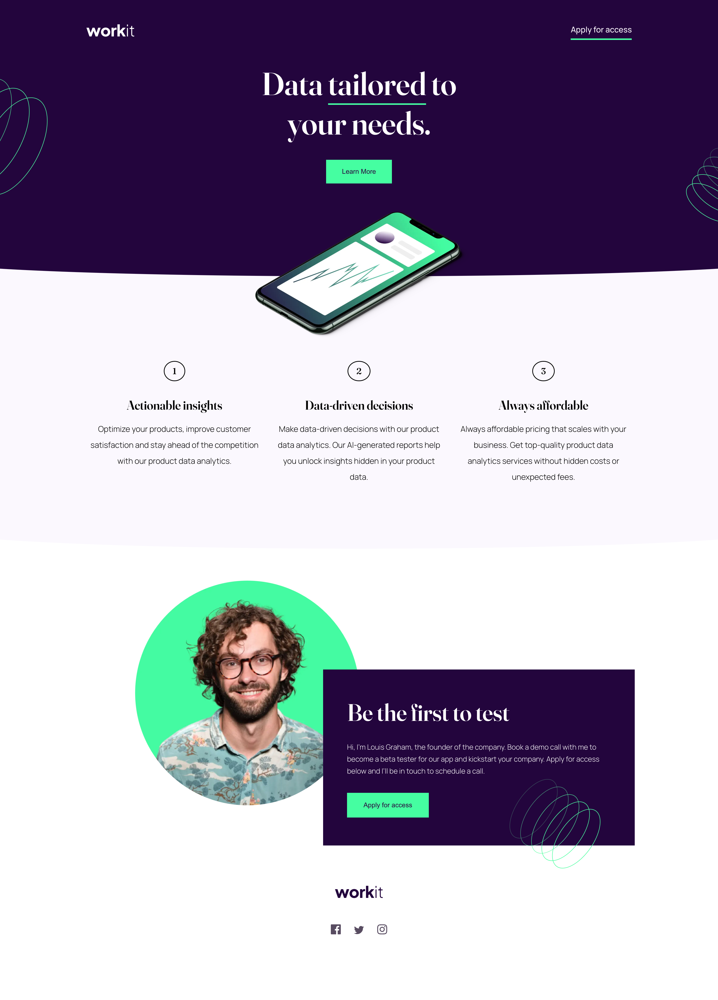

# Frontend Mentor - Workit landing page solution

This is a solution to the [Workit landing page challenge on Frontend Mentor](https://www.frontendmentor.io/challenges/workit-landing-page-2fYnyle5lu). Frontend Mentor challenges help you improve your coding skills by building realistic projects. 

## Table of contents

- [Overview](#overview)
  - [The challenge](#the-challenge)
  - [Screenshot](#screenshot)
  - [Links](#links)
- [My process](#my-process)
  - [Built with](#built-with)
  - [What I learned](#what-i-learned)
  - [Continued development](#continued-development)
- [Author](#author)
- [Acknowledgments](#acknowledgments)

## Overview

### The challenge

Users should be able to:

- View the optimal layout for the interface depending on their device's screen size
- See hover and focus states for all interactive elements on the page

### Screenshot

### Links

- Solution URL: [Add solution URL here](https://your-solution-url.com)
- Live Site URL: [Add live site URL here](https://your-live-site-url.com)

## My process

I started by approaching the project with a mobile first workflow. Gradually styling each breakpoint until I was satisfied.
I used SASS to style my HTML an

### Built with

- Semantic HTML5 markup
- CSS custom properties
- Flexbox
- SASS
- Mobile-first workflow
- Emmet

### What I learned

I learned alot during this project. I learned that I need to do a better job of keeping my CSS clean and that I should refactor more often and not at the end of a project like I had here. This was my first project with 3 breakpoints and it was definitely a hurdle for me to overcome but in that process, I also learned alot of about absolute position and the need to keep my `z-index` organized. 

### Continued development

In the future I will make a large effort to keep my code cleaner, as if a psychopathic programmer is the next to maintain it, who will hunt me down if its not clean.

## Author

- Website - [Jeff Stanley](https://js-law.github.io/portfolio/)
- Frontend Mentor - [@JS-Law](https://www.frontendmentor.io/profile/JS-Law)
- Twitter - [@JustDevPosts](https://www.twitter.com/JustDevPosts)

## Acknowledgments

I gotta shout out:
- FrontendMentor
- StackOverflow
- X

